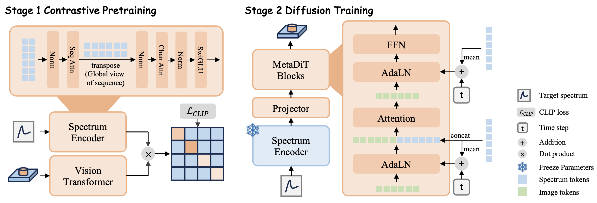

<h1 align="center">
MetaDiT: Enabling Fine-grained Constraints in High-degree-of Freedom Metasurface Design
</h1>

<div align="center">

<a href="https://arxiv.org/abs/2508.05076"></a>
<a href="https://huggingface.co/datasets/Hao-Li-131/MetaDiT-AAAI2026"></a>
[](https://github.com/JessePrince/metadit/stargazers)

</div>

The official code implementation of paper **MetaDiT: Enabling Fine-grained Constraints in High-degree-of Freedom Metasurface Design** in AAAI 2026.



**Highlights**
- 🌌 Design all parameters by encoding features into different channels, not just the shape!
- 📈 High resolution spectrum constraints, never miss the important details!
- 📊 New metrics, to further evaluate the robustness of the model.
- 🕹️ Coarse to fine condition injection in DiT and contrastively pre-trained spectrum encoder empowers strong performance of MetaDiT!

## 🔉 News
- [2025.11.08] 🎉 Our paper is accepted by AAAI 2026, we are about to refactor this code base for better readability!
- [2025.08.02] 🔥 We release the first version of our code! We will add more comments and optimize the code structure in the future!

## 💿 Setups
First clone this repository
```bash
git clone https://github.com/JessePrince/metadit.git
```

`cd` to the directory
```bash
cd metadit
```

Then, install `uv`
```bash
pip install uv
```

and install dependencies
```bash
uv sync
source .venv/bin/activate
```

Install PyTorch based on your CUDA version
```bash
# First uninstall the torch from uv
uv cache clean
uv pip uninstall torch
uv pip uninstall torchvision
uv pip uninstall torchaudio

# Check your CUDA version
nvcc -V

# If the above command failed, use
nvidia-smi

# Install PyTorch according to your CUDA version (cu118, cu126, cu128)
uv pip install torch==2.7.1 torchvision==0.22.1 torchaudio==2.7.1 --index-url https://download.pytorch.org/whl/cu126
```

Download dataset from https://github.com/SensongAn/Meta-atoms-data-sharing. You can split the dataset to train/val/test set by yourself or use our split version.

## 🎯 Training
To train the surrogate model
```bash
bash scripts/train_surrogate.sh
```

The arguments include
- `--num_epoch` Number of epochs to train
- `--batch_size` batch size for training
- `--warmup_ratio` warmup ratio for learning rate
- `--optimizer` optimizer to use, supports AdamW only
- `--lr` learning rate
- `--weight_decay` weight decay used in the optimizer
- `--data_path` path to train data (.mat)
- `--val_path` path to validation data (.mat)
- `--num_workers` number of workers for dataloader
- `--use_checkpointing` Whether to use gradient checkpointing
- `--save_dir` path to save
- `--save_total_limit` maximum save limit

More arguments can be found in `train/train_surrogate.py`.

To train the Spectrum Encoder using CLIP
```bash
bash scripts/train_clip.sh
```

The arguments include
- `--num_epoch` Number of epochs to train
- `--batch_size` batch size for training
- `--warmup_ratio` warmup ratio for learning rate
- `--optimizer` optimizer to use, supports AdamW only
- `--lr` learning rate
- `--weight_decay` weight decay used in the optimizer
- `--data_path` path to train data (.mat)
- `--val_path` path to validation data (.mat)
- `--num_workers` number of workers for dataloader
- `--use_checkpointing` Whether to use gradient checkpointing
- `--save_dir` path to save
- `--high_res_spec` Whether to use high resolution spectrum
- `--condition_channel` channel of the spectrum

More arguments can be found in `train/train_clip.py`.

To train the MetaDiT model
```bash
bash scripts/train_metadit.sh
```

The arguments include
- `--num_epoch` Number of epochs to train
- `--batch_size` batch size for training
- `--warmup_ratio` warmup ratio for learning rate
- `--optimizer` optimizer to use, supports AdamW only
- `--lr` learning rate
- `--weight_decay` weight decay used in the optimizer
- `--data_path` path to train data (.mat)
- `--val_path` path to validation data (.mat)
- `--num_workers` number of workers for dataloader
- `--use_checkpointing` Whether to use gradient checkpointing
- `--save_dir` path to save
- `--high_res_spec` Whether to use high resolution spectrum
- `--condition_channel` channel of the spectrum
- `--pretrain_encoder` path to the pretrained encoder
        

## ⚙️ Inference
To sample material from MetaDiT on the test set
```bash
bash scripts/test_metadit.sh
```

The arguments include
- `--seed` random seed used in inference
- `--ckpt` path to the MetaDiT checkpoint
- `--num_sampling_steps` number of diffusion sampling steps
- `--data_path` path to the test set
- `--batch_size` batch size used in sampling
- `--resolution` resolution of the spectrum
- `--save_path` path to save the sampling results
- `--high_res_spec` whether to use high resolution spectrum.

We support distributed inference (DDP inference), if you have multiple GPUs, please set the corresponding `--num_proccesses` when you use `accelerate launch`.

To calculate the AAE and AAE&K score
```bash
python calc_aae.py --data_path <path to the sampling results> --model_path <path to the surrogate model>
```
The folder structure should be 
- Sampling results
  - xxx_rank0.json
  - xxx_rank1.json
  - ...


To calculate AAE&K
```bash
python calc_aaeandk.py --data_path <path to the sampling results> --model_path <path to the surrogate model>
```

The folder structure should be
- Sampling results
  - xxx_seed0
    - xxx_rank0.json
    - xxx_rank1.json
    - ...
  - xxx_seed7
    - xxx_rank0.json
    - xxx_rank1.json
    - ...
  - xxx_seed42
    - xxx_rank0.json
    - xxx_rank1.json
    - ...
  - xxx_seed3407
    - xxx_rank0.json
    - xxx_rank1.json
    - ...

## ⏲️ Accelerators
We suggest at least 4 GPUs with more than 24GB memory, we used 4$\times$ Nvidia A100 80GB in this project.

## 👀 Citation
```bibtex
@article{li2025metadit,
  title={MetaDiT: Enabling Fine-grained Constraints in High-degree-of Freedom Metasurface Design},
  author={Li, Hao and Bogdanov, Andrey},
  journal={arXiv preprint arXiv:2508.05076},
  year={2025}
}
```
